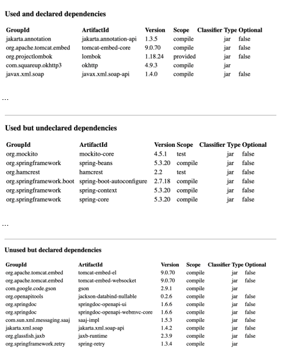

# Dependencies Management


## Challenges
Les projets Maven peuvent utiliser de nombreuses dépendances nécessaire à l'accomplissement des tâches que l'application ou la librairie produite doit effectuer. Ces dépendances peuvent comporter des bugs, des failles de sécurité. Egalement, elles peuvent évoluer au fur et à mesure des versions pour apporter de nouvelles fonctionnalités, corriger des failles ou bugs. Afin de maintenir correctement les applications dans le temps, il est nécessaire de bien maitriser les versions des dépendances utilisées, en suivant les pratiques en vigueur qui sont rappelées ici.

## TL;DR

_Les dépendances d'un projet java:_
 * ne devraient pas occasionner des conflits de versions.
 * devraient être mises à jour régulièrement.
 * devraient être nécessaires et suffisantes.

### Quelques rappels

Documentation de référence.
	https://maven.apache.org/guides/introduction/introduction-to-dependency-mechanism.html
D
### Dépendances transitives
Si une application A utilise une dépendance B et que B utilise une dépendance C, alors la dépendance C est une dépendance transitive pour l'application A.

### Mécanisme de résolution des dépendances par Maven
Lorsqu'une dépendance est déclarée à plusieurs endroits de l'arbre de dépendances d'un projet, c'est la dépendance qui est la plus "proche" qui est retenue. Ci après une traduction de la documentation maven (paragraphe "Dependency mediation" de la documentation de référence sus citée)

Maven: médiation de dépendances

* Médiation de dépendance : elle détermine quelle version d'un artefact sera choisie lorsque plusieurs versions sont rencontrées en tant que dépendances. Maven choisit la "définition la plus proche". Autrement dit, il utilise la version de la dépendance la plus proche de votre projet dans l'arborescence des dépendances. Vous pouvez toujours garantir une version en la déclarant explicitement dans le POM de votre projet. Notez que si deux versions de dépendances se trouvent à la même profondeur dans l’arborescence des dépendances, la première déclaration l’emporte.
* " définition la plus proche » signifie que la version utilisée sera la plus proche de votre projet dans l'arborescence des dépendances. Considérez cet arbre de dépendances :
```
o	  A
o	  ├── B
o	  │   └── C
o	  │       └── D 2.0
o	  └── E
      └── D 1.0
```
Dans le texte, les dépendances pour A, B et C sont définies comme A -> B -> C -> D 2.0 et A -> E -> D 1.0, alors D 1.0 sera utilisé lors de la construction de A car le chemin de A à D à E est plus court. Vous pouvez explicitement ajouter une dépendance à D 2.0 dans A pour forcer l'utilisation de D 2.0, comme indiqué ici :
```
  A
  ├── B
  │   └── C
  │       └── D 2.0
  ├── E
  │   └── D 1.0
  │
  └── D 2.0
```

On peut constater que ce mécanisme de résolution comporte une fragilité liée à l'ordre de déclaration des dépendances.
Maven: fragilité de la résolution des dépendances
Considérons cet arbre de dépendances défini dans le fichier pom.xml du projet:
```
  A
  ├── B
  │   └── C 1.0
  └── D
      └── C 2.0
```
Dans ce cas, la dépendance qui sera effectivement résolue est C 1.0
Si cependant lors de la vie du projet l'ordre de déclaration change (ce qui a de fortes chances d'arriver) et devient
```
  A
  ├── D
  │   └── C 2.0
  └── B
      └── C 1.0
```
Dans ce cas, la dépendance qui sera effectivement résolue est C 2.0. Après un tel changement le comportement du projet peut changer: fonctionnalité changée, effet de bord, voire impossibilité de construire.
Cette fragilité (pas forcément connue de tous) montre qu'il est préférable de bien maitriser les dépendances d'un projet.

## Recommendations

### N'utiliser que les dépendances strictement nécessaires.
On constate assez souvent que des dépendances inutiles sont présentes dans les projets maven. Par exemple, si un batch utilise la dépendance "spring-boot-starter-web", on est en droit de se poser des questions: est ce qu'un batch a vocation à exposer une API REST ou servir du contenu Web?
D'une manière générale, les dépendances inutiles sont préjudiciables:
* d'un point de vue sécurité, elles augmentent la surface d'attaque.
* elles peuvent occasionner des conflits de version avec les dépendances véritablement utiles.
* d'un point de vue ressources, on produit des artefacts plus gros: plus de stockage nécessaire, plus de mémoire nécessaire, temps de démarrage pouvant être plus long... etc
* d'un point de vue coût de maintenance: toute dépendance d'un projet nécessite une gestion durant toute la vie du projet.

### Déclarer les dépendances effectivement utilisées.
Lorsque le code d'un projet maven utilise explicitement des éléments d'une dépendance (ex: org.apache.commons.lang3.StringUtils#isNotBlank), alors cette dépendance doit être déclarée explicitement dans le fichier pom.xml du projet maven, plutôt que d'utiliser cette dépendance de manière transitive. Cela permet:
* d'éviter des dépendances induites (qui pourraient être inutiles par ailleurs)
* éventuellement faire disparaître des dépendances qui ne sont plus nécessaires.
* de rendre la construction impossible (compilation ko) suite à un changement de dépendance (la dépendance transitive peut disparaître)
* de comprendre quels sont les besoins techniques couverts du projet, et d'éviter de rajouter des dépendances évitables. Par exemple, si, de manière explicite, on sait que le projet dispose d'une librairie de manipulation JSON (par exemple com.fasterxml.jackson:jackson-databind), il sera moins probable qu'on rajoute par mégarde une autre librairie JSON (par exemple: com.google.code.gson:gson) qui a de forte chance d'être redondante.

### Gestion stricte des versions des dépendances.

Afin de favoriser une maintenance efficiente d'un projet maven, il est fortement recommandé d'activer au plus tôt dans la vie du projet le contrôle "dependency convergence" (voir ci après) et de faire échouer le build si ce contrôle est négatif. Cette gestion permet de s'assurer que toutes les dépendances sont définies sans ambiguïté et que les conflits de version sont résolus dés qu'ils sont détectés.

### Résolution d'un conflit de version

Lorsque le contrôle de "dependency convergence" échoue, les dépendances divergentes sont indiquées ainsi que leur position dans l'arbre des dépendances du projet. Il faut alors choisir la dépendance à retenir. Il n'y a pas de règle générale, mais il y a un cas (assez fréquents) où le choix est peu risqué: à condition que les versions des dépendances suivent la convention du semver (majeure.mineure.correctif plus de détails ici: https://semver.org/lang/fr/), si les versions ne diffère que d'un numéro correctif ou mineur (v.w.x vs v.w.y ou bien v.w.x vs v.y.z), alors le risque est théoriquement null de choisir la version la plus récente.
Cependant, la situation où les versions ont des numéros de majeure distincts, la résolution peut être beaucoup plus délicate: il est possible que le choix de la version la plus récente rende l'application dysfonctionnelle: dans certains cas, l'application ne compile plus: c'est ce qui arrive si le code du projet utilise la librairie incriminée. La solution la plus "évidente" est d'adapter le code du projet pour le rendre compatible avec la librairie la plus récente. Dans d'autres cas (pernicieux) les problèmes sont vus au runtime (typiquement des exceptions de type java.lang.NoClassDefFoundError ou java.lang.NoSuchMethodError). Ce problème est d'autant plus pernicieux qu'il peut n'apparaître que dans certains cas qu'on ne sait pas identifier (à moins de très bien connaître le fonctionnement interne des dépendances à l'origine du conflit de version). On rencontre ce genre de problème lorsque deux dépendances du projet utilisent chacune une version incompatible de la dépendance conflictuelle. Il y a différentes possibilités de résolution :
* modifier (quand cela est possible) la dépendance qui utilise la version la plus ancienne de la dépendance en conflit
* modifier les versions des dépendances utilisatrices pour trouver la(les) version(s) où elles utilisent chacune une version compatible: mais en général ici, c'est au détriment des fonctionnalités car il va en général falloir descendre le numéro de version d'une des dépendances à l'origine du conflit.
* refactorer le code du projet de manière à ne plus dépendre d'une des librairies à l'origine du conflit de version
* si vraiment aucune des solutions précédentes n'est possible: créer une version "shaded" de la dépendance qui utilise la dépendance en conflit la plus ancienne en utilisant le plugin maven adéquat. C'est une technique avancée qui est relativement complexe et fastidieuse. Elle consiste à redéfinir les namespaces des classes de la dépendance en conflit et à mettre à jour leur usage dans la dépendance utilisatrice. Plus d'informations ici: https://maven.apache.org/plugins/maven-shade-plugin/. une fois la version "shaded" créée, on remplace dans les dépendances du projet la dépendance à l'origine du problème par sa version "shaded"

### Définition stricte de la version d'une dépendance
La section "dependency-management" du fichier pom.xml du projet permet de fixer de manière univoque la version d'une dépendance. C'est ici que l'on résout les conflits de versions.

Utiliser les BOMs

S'assurer (et donc tester) que différentes librairies indépendantes fonctionnent correctement ensemble peut être une tâche complexe et chronophage. Certains éditeurs (comme Spring) fournissent des Bill Of Materials (BOMs) qui permettent de définir des ensembles de librairies qui sont compatibles entre elles. L'import (ou l'heritage via pom parent) de ces BOMs permet d'affranchir le développeur de la gestion des versions de ces librairies.
Dans le cas de projets logiciels complexes, créer des BOMs pour les librairies qui sont créées pour les besoins de ces projets peut représenter une réelle plus value. En centralisant la gestion de la compatibilité des librairies entre elles, on peut diminuer significativement l'effort à fournir pour maintenir les dépendances de chaque projet maven. Dans ce cas d'ailleurs, les projets maven n'ont quasiment plus besoin de définir les versions de leurs dépendances. Autrement dit la section "dependencies" du fichier pom.xml ne devrait définir quasiment aucune version (les sections "dependency" ne comportent pas la balise "version")

### Eviter d'utiliser plusieurs dépendances pour une même fonctionnalité.

Il est préférable de répondre à un besoin spécifique d'un projet avec une seule dépendance. Par exemple on évitera d'utiliser deux clients http (ex com.squareup.okhttp3:okhttp et org.apache.httpcomponents:httpclient) dans le même projet.
Cette recommendation n'est cependant pas toujours applicable: il se peut que l'on "subisse" des dépendances transitives "redondantes" du fait de l'utilisation de librairies ayant couvert leurs propres besoins techniques de manière indépendante.

### Attention au scope (portée) des dépendances.

Pour mention, il arrive, par inadvertance, que des dépendances de test soient inclues dans les dépendances de production.

### Mise à jour régulière des dépendances.

La mise à jour des dépendances d'un projet "au fil de l'eau" est une bonne pratique communément admise. Notamment les mises à jour de sécurité critiques sont facilitées (ex: log4shell). Dans le cadre des applications sensibles de la CNAM cela devient impératif.
Des outils comme 'dependabot' qui s'intègrent à Gitlab servent à faciliter le processus de mise à jour régulière des dépendances (l'outil génère des merge requests de mise à jour des dépendances). Dans les pratiques couramment constatées, on effectue une analyse dependabot suivie d'une mise à jour toutes les semaines.
La mise à jour de dépendances peut altérer le comportement d'une application. Une bonne couverture de tests permet d'addresser ce risque.

###  Analyser les dépendances (transitives) existantes avant d'ajouter une nouvelle dépendance.

Lorsqu'un projet a besoin d'une nouveau service technique, par exemple un client http, et qu'il existe plusieurs librairies pouvant rendre ce service, on a intérêt à regarder dans les dépendances transitives si une telle librairie n'est pas déjà présente. Cela évitera une redondance fonctionnelle dans les dépendances du projet.
Egalement, vérifier si le jdk ne fournit pas dèjà le service désiré. A titre d'exemple, il n'y a pas lieu d'utiliser la librairie "joda-time", le jdk propose, depuis Java 1.8, l'api date/time (JSR 310).

###  Attention aux dépendances "fantômes".

Certaines librairies ont pour leur propres besoins effectué un shading de certaines de leur dépendances. C'est le cas par exemple de testcontainers qui a fait un shading de (entre autres) la librairie de sérialisation Jackson. Ainsi pour testcontainers, le namespace com.fasterxml.jackson est remplacé par org.testcontainers.shaded.com.fasterxml.jackson. On peut ainsi, par inadvertance, déclarer un object mapper de type org.testcontainers.shaded.com.fasterxml.jackson.databind.ObjectMapper alors qu'on s'attend à utiliser le type com.fasterxml.jackson.databind.ObjectMapper.
Outillage
Traquer les conflits de versions des dépendances: Dependency convergence.
Voici un exemple de configuration du plugin maven "enforcer". Celui ci va faire échouer le build si des conflits de version sont détectés
pom.xml
```
<?xml version="1.0" encoding="UTF-8"?>
<project xmlns="http://maven.apache.org/POM/4.0.0" xmlns:xsi="http://www.w3.org/2001/XMLSchema-instance" xsi:schemaLocation="http://maven.apache.org/POM/4.0.0 https://maven.apache.org/xsd/maven-4.0.0.xsd">
...
    <build>
        <plugins>
            ...
            <plugin>
                <groupId>org.apache.maven.plugins</groupId>
                <artifactId>maven-enforcer-plugin</artifactId>
                <version>3.1.0</version>
                <executions>
                    <execution>
                        <configuration>
                            <rules>
                                <DependencyConvergence />
                            </rules>
                        </configuration>
                        <goals>
                            <goal>enforce</goal>
                        </goals>
                    </execution>
                </executions>
            </plugin>
            ...
        </plugins>
    </build>
...
</project>
```
Voici un exemple de build qui échoue:
Echec dependency convergence

```
...
[WARNING]
Dependency convergence error for org.apache.xmlgraphics:xmlgraphics-commons:jar:2.3:compile paths to dependency are:
+-fr.gouv.cnam.xxx:yyy:jar:1.0.0-SNAPSHOT
  +-org.apache.xmlgraphics:fop:jar:2.3:compile
    +-org.apache.xmlgraphics:xmlgraphics-commons:jar:2.3:compile
and
+-fr.gouv.cnam.xxx:yyy:jar:1.0.0-SNAPSHOT
  +-org.apache.xmlgraphics:fop:jar:2.3:compile
    +-org.apache.xmlgraphics:batik-svg-dom:jar:1.10:compile
      +-org.apache.xmlgraphics:batik-css:jar:1.10:compile
        +-org.apache.xmlgraphics:xmlgraphics-commons:jar:2.2:compile
and
+-fr.gouv.cnam.xxx:yyy:jar:1.0.0-SNAPSHOT
  +-org.apache.xmlgraphics:fop:jar:2.3:compile
    +-org.apache.xmlgraphics:batik-bridge:jar:1.10:compile
      +-org.apache.xmlgraphics:xmlgraphics-commons:jar:2.2:compile
and
+-fr.gouv.cnam.xxx:yyy:jar:1.0.0-SNAPSHOT
  +-org.apache.xmlgraphics:fop:jar:2.3:compile
    +-org.apache.xmlgraphics:batik-awt-util:jar:1.10:compile
      +-org.apache.xmlgraphics:xmlgraphics-commons:jar:2.2:compile

[ERROR] Rule 0: org.apache.maven.plugins.enforcer.DependencyConvergence failed with message:
Failed while enforcing releasability. See above detailed error message.
[INFO] ------------------------------------------------------------------------
[INFO] BUILD FAILURE
[INFO] ------------------------------------------------------------------------
...
```
Ce résultat indique que la dépendance "org.apache.xmlgraphics:xmlgraphics-commons:jar" est en conflit de version car elle existe en version 2.2 et 2.3 dans le projet. Si on choisi la version 2.3, on peut fixer cette version dans la section "dependencyManagement" du fichier pom.xml.
pom.xml - spécification explicite de la version d'une dépendance
```
<?xml version="1.0" encoding="UTF-8"?>
<project xmlns="http://maven.apache.org/POM/4.0.0" xmlns:xsi="http://www.w3.org/2001/XMLSchema-instance" xsi:schemaLocation="http://maven.apache.org/POM/4.0.0 https://maven.apache.org/xsd/maven-4.0.0.xsd">
...
    <dependencyManagement>
        <dependencies>
            ...
            <dependency>
                <groupId>org.apache.xmlgraphics</groupId>
                <artifactId>xmlgraphics-commons</artifactId>
                <version>2.3</version>
            </dependency>
             ...
         </dependencies>
    </dependencyManagement>
...
</project>
````
Avoir une vision synthétique des dépendances: Dependency analysis.
Le plugin maven "dependency" permet de créer un rapport html qui permet de connaitre pour un projet maven:
* les dépendances déclarées et effectivement utilisées par le code du projet
* les dépendances utilisées par le code du projet mais non déclarées (permet de les déclarer. Voir le paragraphe Déclarer les dépendances effectivement utilisées). On peut se permettre cependant de ne pas prendre en compte des dépendances "courantes" de spring (versions maitrisées par l'éditeur via un BOM, fournies par les starters spring boot, présentes dans la quasi totalité des modules spring).
* les dépendances déclarées mais non utilisées par le code (permet de n'utiliser que les dépendances nécessaires. Ne pas tenir compte cependant des starters spring boot car ils ne sont que des conteneurs de dépendances)

* dans le répertoire du projet

````
mvn dependency:analyze-report
````

* produit le rapport ./target/dependency-analysis.html
Voici un exemple de rapport produit





Trouver les mises à jour de dépendances: Display dependency updates
Le plugin maven "versions" permet de lister les mises à jour de dépendances disponibles pour un projet. La documentation est ici: https://www.mojohaus.org/versions/versions-maven-plugin/display-dependency-updates-mojo.html
versions:display-dependency-updates (exemple)
````
# dans le répertoire du projet
mvn versions:display-dependency-updates
# résultat (extrait)
...
[INFO] The following dependencies in Dependency Management have newer versions:
[INFO]   antlr:antlr ........................................ 2.7.7 -> 20030911
[INFO]   ch.qos.logback:logback-access ....................... 1.2.12 -> 1.4.14
...
[INFO] The following dependencies in Dependencies have newer versions:
[INFO]   com.fasterxml.jackson.dataformat:jackson-dataformat-xml ...
[INFO]                                                         2.15.2 -> 2.17.0
[INFO]   com.google.zxing:core ................................. 3.5.0 -> 3.5.3
...
[INFO] The following dependencies in pluginManagement of plugins have newer versions:
[INFO]   org.springframework.boot:spring-boot-maven-plugin .... 2.7.16 -> 3.2.4
...
[INFO] The following dependencies in Plugin Dependencies have newer versions:
[INFO]   org.liquibase:liquibase-core ........................ 4.22.0 -> 4.26.0
...
[INFO] ------------------------------------------------------------------------
[INFO] BUILD SUCCESS
[INFO] ------------------------------------------------------------------------
````